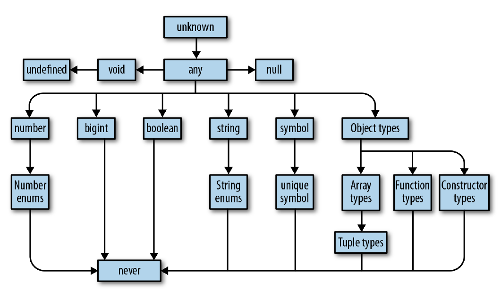
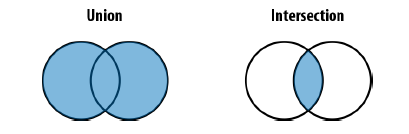
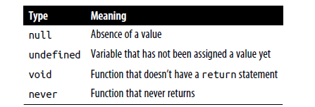
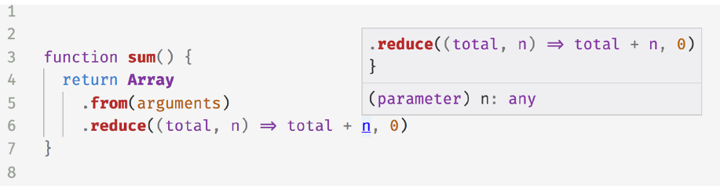

| col1 | col2 | col3 |
| ---- | ---- | ---- |
|      |      |      |
|      |      |      |

## Getting Started Locally

To install the latest version of TypeScript globally, run the following command:

    npm i -g typescript

Now, you’ll be able to run TypeScript on the command line with the tsc (**T**ype**S**cript **C**ompiler) command. Try it with the **--version** flag to make sure it’s set up properly:

    tsc --version

## Running Locally

Now that TypeScript is installed, let’s have you set up a folder locally to run TypeScript on code.

Create a folder somewhere on your computer and run this command to create a new **tsconfig.json** configuration file

    tsc --init

Then, run **tsc** and provide it the name of that **index.ts** file:

**
    tsc** index.ts

You can run  **tsc --help**  to get a list of commonly used CLI flags.  [Full CLI Flags](https://www.typescriptlang.org/docs/handbook/compiler-options.html) viewable with **tsc --**   all.

### Pretty Mode

#### **Watch Mode**

tsc CLI is with its **-w/--watch** mode

#### TSConfig Files

Instead of always providing all file names and configuration options to tsc, most configuration options may be specified in a tsconfig.json (“TSConfig”) file in a directory.

You can also pass -p/--project to tsc with a path to a directory containing a tsconfig.json or any file to have tsc use that instead:

    **tsc -p path/to/tsconfig.json**

[tsc file config](https://www.typescriptlang.org/tsconfig)

    **tsc --init**

```json
{
"compilerOptions": {
"lib": ["es2015"],
"module": "commonjs",
"outDir": "dist",
"sourceMap": true,
"strict": true,
"target": "es2015"
},
"include": [
"src"
]
}
```

t**sconfig.json options**

| Option  | Description                                                                                                                                                                                                                                       |
| ------- | ------------------------------------------------------------------------------------------------------------------------------------------------------------------------------------------------------------------------------------------------- |
| include | Which folders should TSC look in to find your TypeScript files?                                                                                                                                                                                   |
| lib     | Which APIs should TSC assume exist in the environment you’ll be running your code in? This includes<br />things like ES5s Function.prototype.bind, ES2015’s Object.assign, and the DOMs<br />document.querySelector.                            |
| module  | Which module system should TSC compile your code to (CommonJS, SystemJS, ES2015, etc.)?                                                                                                                                                           |
| outDir  | Which folder should TSC put your generated JavaScript code in?                                                                                                                                                                                    |
| strict  | Be as strict as possible when checking for invalid code.<br />This option enforces that all of your code is properly typed.<br />We’ll be using it for all of the examples in the book, and you should use it for your TypeScript project too. |
| target  | Which JavaScript version should TSC compile your code to (ES3, ES5, ES2015, ES2016, etc.)?                                                                                                                                                        |

The tsc command line includes an --init command to create a new tsconfig.json file. That newly created TSConfig file will contain a link to the configuration docs as well as most of the allowed TypeScript
configuration options with one-line comments briefly describing their use.

Running this command:

    tsc --init

EsLint

 npm i eslint

   npm init @eslint/config

## Configuration

After running `npm init @eslint/config`, you'll have an `.eslintrc` file in your directory. In it, you'll see some rules configured like this:

```json
{
    "rules": {
        "semi": ["error", "always"],
        "quotes": ["error", "double"]
    }
}
```

### Type Infar

TypeScript can infer, or figure out, that the singer variable is of type string. The most basic types in TypeScript correspond to the seven basic kinds of primitives in JavaScript:

1. null
2. undefined
3. boolean // true or false
4. string // "", "Hi!", "abc123", …
5. number // 0, 2.1, -4, …
6. **bigint // 0n, 2n, -4n, …**
7. **symbol // Symbol(), Symbol("hi"), …**

For each of these values, TypeScript understands the type of the value to be one of the seven basic primitives:

1. null; // null
2. undefined; // undefined
3. true; // boolean
4. "Louise"; // string
5. 1337; // number
6. 1337n; // bigint
7. Symbol("Franklin"); // symbol

#### The Type System

Modern languages have all sorts of different type systems.

A set of rules that a typechecker uses to assign types to your program

```typescript
let a: number = 1 // a is a number
let b: string = 'hello' // b is a string
let c: boolean[] = [true, false] // c is an array of booleans
```

And if you want TypeScript to infer your types for you, just leave them off and let TypeScript get to work:

```typescript
let a = 1 // a is a number
let b = 'hello' // b is a string
let c = [true, false] // c is an array of booleans
```

Right away, you’ll notice how good TypeScript is at inferring types for you. If you leave off the annotations, the types are the same! Throughout this book, we will use

just cd to the root folder and type

    tsc

or

    tsc --outDir

### TypeScript Versus JavaScript

Let’s take a deeper look at TypeScript’s type system, and how it compares to Java‐ Script’s type system. A good understanding of the differences is key to building a mental model of how TypeScript works

| Type system feature                | JavaScript          | TypeScript               |
| ---------------------------------- | ------------------- | ------------------------ |
| How are types bound?               | Dynamically         | Statically               |
| Are types automatically converted? | Yes                 | No (mostly)              |
| When are types checked?            | At runtime          | At compile time          |
| When are errors surfaced?          | At runtime (mostly) | At compile time (mostly) |

### **All About Types**

Type  a set of values and the things you can do with them.



```typescript
function squareOf(n: number) {
    return n * n
}
squareOf(2) // evaluates to 4

// any Tyes 
let ab: any = 666 // any
let ba: any = ['danger'] // any
let ca = a + b // any

// unknown types
let a1: unknown = 30 // unknown
let b1 = a1 === 123 // boolean
// let c1 = a1 + 10 // Error TS2571: Object is of type 'unknown'.
if (typeof a1 === 'number') {
let d = a1 + 10 // number
}

// boolean 
//The boolean type has two values: true and false. You can compare them (with ==,
  //  ===, ||, &&, and ?), negate them (with !), and not much else. Use boolean like this:

  let a2 = true // boolean
var b2 = false // boolean
const c2 = true // true
let d2: boolean = true // boolean
let e2: true = true // true
// let f2: true = false // Error TS2322: Type 'false' is not assignable  to type 'true'.

// number

let an = 1234 // number
var bn = Infinity * 0.10 // number
const cn = 5678 // 5678
let dn = an < bn // boolean
let en: number = 100 // number
let fn: 26.218 = 26.218 // 26.218
// let gn: 26.218 = 10 // Error TS2322: Type '10' is not assignable  to type '26.218'.

// bigint

//let abb = 1234n // bigint
//const bbb = 5678n // 5678n
//var cbb = abb + bbb // bigint
//let dbb = abb < 1235 // boolean
//let ebb = 88.5n // Error TS1353: A bigint literal must be an integer.
//let fbb: bigint = 100n // bigint
//let gbb: 100n = 100n // 100n
//let hbb: bigint = 100 // Error TS2322: Type '100' is not assignable  to type 'bigint'.


//string is the set of all strings and the things you can do with them like concatenate
// (+), slice (.slice), and so on. Let’s see some examples:
let aS = 'hello' // string
var bS = 'billy' // string
const cS = '!' // '!'
let dS = a + ' ' + b + c // string
let eS: string = 'zoom' // string
let fS: 'john' = 'john' // 'john'
// let gS: 'john' = 'zoe' // Error TS2322: Type "zoe" is not assignable to type "john".

/// symbol 

// let aSM = Symbol('a') // symbol
// let bSM: symbol = Symbol('b') // symbol
// var cSM = a === b // boolean
```

Objects

Structural typing
A style of programming where you just care that an object has certain properties, and not what its name is (nominal typing). Also called duck typing in some languages (or, not judging a book by its cover).

```typescript


let a = {
b: 'x'
} // {b: string}
a.b // string
let b = {
c: {
     d: 'f'
   }
}


```

##### Type Inference When Declaring Objects with const

What would have happened if we’d used const to declare the object instead?

```typescript
let a: {b: number} = {
b: 12
} // {b: number}
```

Object literal syntax says,

```typescript
let c: {
 firstName: string
 lastName: string
} = {
 firstName: 'john',
 lastName: 'barrowman'
}
class Person {
constructor(
public firstName: string, // public is shorthand for
// this.firstName = firstName
public lastName: string
) {}
}
c = new Person('matt', 'smith') // OK
```

Can you tell TypeScript that something is optional, or that there might be more properties than you planned for? You bet:

```typescript
let a: {
b: number
c?: string
[key: number]: boolean
}
```

Index Signatures

The [key: T]: U syntax is called an index signature, and this is the way you tell TypeScript that the given object might contain more keys. The way to read it is, “For this object, all keys of type T must have values of type U.” Index signatures let you safely add more keys to an object, in addition to any keys that you explicitly declared.

```typescript
let airplaneSeatingAssignments: {
 [seatNumber: string]: string
} = {
'34D': 'Boris Cherny',
'34E': 'Bill Gates'
}

let user: {
readonly firstName: string
} = {
firstName: 'abby'
}
user.firstName // string
user.firstName =
'abbey with an e' // Error TS2540: Cannot assign to 'firstName' because it is a read-only property.
```

**Intermission: Type Aliases, Unions, and Intersections**

**Type aliases**
Just like you can use variable declarations (let, const, and var) to declare a variable that aliases a value, you can declare a type alias that points to a type. It looks like this:

```typescript
type Age = number
type Person = {
    name: string
    age: Age
}
```

Age is but a number. It can also help make the definition of the Person shape easier to understand.

Aliases are never inferred by TypeScript, so you have to type them explicitly:

```typescript
let age: Age = 55
let driver: Person = {
   name: 'James May'
   age: age
}
```

Like JavaScript variable declarations (let, const, and var), you can’t declare a type twice:

```typescript
type Color = 'red'
type Color = 'blue' // Error TS2300: Duplicate identifier 'Color'.
```

And like let and const, type aliases are block-scoped. Every block and every function has its own scope, and inner type alias declarations shadow outer ones:

```typescript
type Color = 'red'
let x = Math.random() < .5
if (x) {
    type Color = 'blue' // This shadows the Color declared above.
    let b: Color = 'blue'
} else {
   let c: Color = 'red'
}
```

**Union and intersection types**



TypeScript gives us special type operators to describe unions and intersections of types: **|** for union and & for intersection. Since types are a lot like sets, we can think of them in the same way:

```typescript
type Cat = {name: string, purrs: boolean}
type Dog = {name: string, barks: boolean, wags: boolean}
type CatOrDogOrBoth = Cat | Dog
type CatAndDog = Cat & Dog
```

```typescript
let b: CatAndDog = {
   name: 'Domino',
   barks: true,
   purrs: true,
   wags: true
}
// Cat
let a: CatOrDogOrBoth = {
  name: 'Bonkers',
  purrs: true
}
// Dog
a = {
  name: 'Domino',
  barks: true,
  wags: true
}
```

Arrayes

```typescript
let ar = [1, 2, 3] // number[]
var br = ['a', 'b'] // string[]
let cr: string[] = ['a'] // string[]
let dr = [1, 'a'] // (string | number)[]
const er = [2, 'b'] // (string | number)[]
let fr = ['red']
fr.push('blue')
//fr.push(true) // Error TS2345: Argument of type 'true' is not assignable to parameter of type 'string'.
let gr = [] // any[]
gr.push(1) // number[]
gr.push('red') // (string | number)[]
let hr: number[] = [] // number[]
hr.push(1) // number[]
// hr.push('red') // Error TS2345: Argument of type '"red"' is not assignable to parameter of type 'number'.
```

Like with objects, creating arrays with const won’t hint to TypeScript to infer their types more narrowly. That’s why TypeScript inferred both d and e to be arrays of     **number | string.**

```typescript
function buildArray() {
   let a = [] // any[]
   a.push(1) // number[]
   a.push('x') // (string | number)[]
   return a
}
let myArray = buildArray() // (string | number)[]
myArray.push(true) // Error 2345: Argument of type 'true' is not
// assignable to parameter of type 'string | number'.
```

**Tuples**

Tuples are subtypes of array. They’re a special way to type arrays that have fixed lengths, where the values at each index have specific, known types.

```typescript
let a: [number] = [1]
// A tuple of [first name, last name, birth year]
let b: [string, string, number] = ['malcolm', 'gladwell', 1963]
b = ['queen', 'elizabeth', 'ii', 1926] // Error TS2322: Type 'string' is not
// assignable to type 'number'.

// Tuples also support rest elements, which you can use to type tuples with minimum lengths:
// A list of strings with at least 1 element
let friends: [string, ...string[]] = ['Sara', 'Tali', 'Chloe', 'Claire']
// A heterogeneous list
let list: [number, boolean, ...string[]] = [1, false, 'a', 'b', 'c']
```

```typescript
//Tuples support optional elements too. Just like in object types, ? means “optional”:
// An array of train fares, which sometimes vary depending on direction
let trainFares: [number, number?][] = [
   [3.75],
   [8.25, 7.70],
   [10.50]
]
// Equivalently:
let moreTrainFares: ([number] | [number, number])[] = [
// ...
]
```

**Read-only arrays and tuples**

```typescript
let as: readonly number[] = [1, 2, 3] // readonly number[]
let bs: readonly number[] = as.concat(4) // readonly number[]
let three = bs[2] // number
// as[4] = 5 // Error TS2542: Index signature in type
// 'readonly number[]' only permits reading.
// as.push(6) // Error TS2339: Property 'push' does not
// exist on type 'readonly number[]'.

type A = readonly string[] // readonly string[]
type B = ReadonlyArray<string> // readonly string[]
type C = Readonly<string[]> // readonly string[]
type D = readonly [number, string] // readonly [number, string]
type E = Readonly<[number, string]> // readonly [number, string]


```

```typescript

//============= null, undefined, void, and never ==============

// (a) A function that returns a number or null
function af(x: number) {
    if (x < 10) {
        return x
    }
    return null
}
// (b) A function that returns undefined
function bf() {
    return undefined
}
// (c) A function that returns void
function c() {
    let a = 2 + 2
    let b = a * a
}
// (d) A function that returns never
function df() {
    throw TypeError('I always error')
}
// (e) Another function that returns never
function ef() {
    while (true) {
        doSomething()
    }
}

function doSomething() {
    console.log('hello world');
}
```



**Enums**
Enums are a way to enumerate the possible values for a type. They are unordered data structures that map keys to values. Think of them like objects where the keys are

```typescript
enum Language {
   English,
   Spanish,
   Russian
}
enum Languages {
   English = 0,
   Spanish = 1,
   Russian = 2
}
```

To retrieve a value from an enum, you access it with either dot or bracket notation— just like you would to get a value from a regular object:

```typescript
let myFirstLanguage = Language.Russian // Language
let mySecondLanguage = Language['English'] // Language
enum Language1 {
  English = 100,
  Spanish = 200 + 300,
  Russian // TypeScript infers 501 (the next number after 500)
}
enum Color {
    Red = '#c10000',
    Blue = '#007ac1',
    Pink = 0xc10050, // A hexadecimal literal
    White = 255 // A decimal literal
}
let red = Color.Red // Color
let pink = Color.Pink // Color


```

#### **Declaring and Invoking Functions**

In JavaScript, functions are first-class objects. That means you can use them exactly like you would any other object: assign them to variables, pass them to other functions, return them from functions, assign them to objects and prototypes, write properties to them, read those properties back, and so on. There is a lot you can do with functions in JavaScript, and TypeScript models all of those things with its rich type system.

```typescript
function add(a: number, b: number) {
    return a + b
}

function addWithReturnNumber(a: number, b: number): number {
    return a + b
}

// Named function
function greet(name: string) {
    return 'hello ' + name
}
// Function expression
let greet2 = function (name: string) {
    return 'hello ' + name
}
// Arrow function expression
let greet3 = (name: string) => {
    return 'hello ' + name
}
// Shorthand arrow function expression
let greet4 = (name: string) =>
    'hello ' + name
// Function constructor
let greet5 = new Function('name', 'return "hello " + name')
```

Besides function constructors (which you shouldn’t use unless you are being chased by bees because they are totally unsafe),1 all of these syntaxes are supported by Type‐Script in a typesafe way, and they all follow the same rules around usually mandatory type annotations for parameters and optional annotations for return types.

1. A parameter is a piece of data that a function needs to run, declared as part of a function declaration. Also called a formal parameter.
2. An argument is a piece of data that you passed to a function when invoking it. Also called an actual parameter.

**Optional and Default Parameters**

Like in object and tuple types, you can use ? to mark parameters as optional.

```typescript
function log(message: string, userId?: string) {
let time = new Date().toLocaleTimeString()
console.log(time, message, userId || 'Not signed in')
}
log('Page loaded') // Logs "12:38:31 PM Page loaded Not signed in"
log('User signed in', 'da763be') // Logs "12:38:31 PM User signed in da763be"

function log(message: string, userId = 'Not signed in') {
let time = new Date().toISOString()
console.log(time, message, userId)
}
log('User clicked on a button', 'da763be')
log('User signed out')

type Context = {
   appId?: string
   userId?: string
}
function log(message: string, context: Context = {}) {
    let time = new Date().toISOString()
    console.log(time, message, context.userId)
}
```

**Rest Parameters**

If a function takes a list of arguments, you can of course simply pass the list in as an array:

```typescript
function sum(numbers: number[]): number {
     return numbers.reduce((total, n) => total + n, 0)
}
sum([1, 2, 3]) // evaluates to 6

function sumVariadic(): number {
     return Array
     .from(arguments)
     .reduce((total, n) => total + n, 0)
}
sumVariadic(1, 2, 3) // evaluates to 6
```



```typescript
function sumVariadicSafe(...numbers: number[]): number {
     return numbers.reduce((total, n) => total + n, 0)
}
sumVariadicSafe(1, 2, 3) // evaluates to 6
```

**call, apply, and bind**
In addition to invoking a function with **parentheses ()**, JavaScript supports at least two other ways to call a function. Take add from earlier in the chapter:

```typescript
function add3(a: number, b: number): number {
return a + b
}
add3(10, 20) // evaluates to 30
add3.apply(null, [10, 20]) // evaluates to 30
add3.call(null, 10, 20) // evaluates to 30
add3.bind(null, 10, 20)() // evaluates to 30
```

**Generator Functions**

Generator functions (generators for short) are a convenient way to, well, generate a bunch of values. They give the generator’s consumer fine control over the pace at which values are produced. Because they’re lazy—that is, they only compute the next value when a consumer asks for it—they can do things that can be hard to do otherwise, like generate infinite lists.

```typescript
function* createFibonacciGenerator() {
     let a = 0
     let b = 1
     while (true) {
        yield a;
       [a, b] = [b, a + b]
    }
}
let fibonacciGenerator = createFibonacciGenerator() // IterableIterator<number>
fibonacciGenerator.next() // evaluates to {value: 0, done: false}
fibonacciGenerator.next() // evaluates to {value: 1, done: false}
fibonacciGenerator.next() // evaluates to {value: 1, done: false}
fibonacciGenerator.next() // evaluates to {value: 2, done: false}
fibonacciGenerator.next() // evaluates to {value: 3, done: false}
fibonacciGenerator.next() // evaluates to {value: 5, done: false}


function* createNumbers(): IterableIterator<number> {
    let n = 0
     while (1) {
    yield n++
   }
}
let numbers = createNumbers()
numbers.next() // evaluates to {value: 0, done: false}
numbers.next() // evaluates to {value: 1, done: false}
numbers.next() // evaluates to {value: 2, done: false}
```

**Iterators**

Iterators are the flip side to generators: while generators are a way to produce a stream of values, iterators are a way to consume those values. The terminology can get pretty confusing, so let’s start with a couple of definitions.

**Any object that contains a property called Symbol.iterator, whose value is a function that returns an iterator. Any object that defines a method called next, which returns an object with the properties value and done.**

```typescript
let numbers = {
*[Symbol.iterator]() {
    for (let n = 1; n <= 10; n++) {
    yield n
   }
 }
}
```

In other words, numbers is an iterable, and calling the generator function numbers [Symbol.iterator]() returns an iterable iterator.

Not only can you define your own iterators, but you can use JavaScript’s built-in iterators for common collection types—Array, Map, Set, String,3 and so on—to do things like:

```typescript
// Iterate over an iterator with for-of
for (let a of numbers) {
      // Spread an iterator
      let allNumbers = [...numbers] // number[]
     // Destructure an iterator
   let [one, two, ...rest] = numbers // [number, number, number[]]
```

```typescript

function area(radius: number): number | null {
    if (radius < 0) {
        return null
    }
    return Math.PI * (radius ** 2)
}
let rr: number = 3
let arr = area(rr)
if (arr !== null) {
    console.info('result:', arr)
}

// function greet(name: string)
type Greet = (name: string) => string
// function log(message: string, userId?: string)
type Log = (message: string, userId?: string) => void
// function sumVariadicSafe(...numbers: number[]): number
type SumVariadicSafe = (...numbers: number[]) => number
```

**Contextual Typing**

```typescript
function times(
    f: (index: number) => void,
    n: number
) {
    for (let i = 0; i < n; i++) {
        f(i)
    }
}
```

**Overloaded Function Types**

The function type syntax we used in the last section—type Fn = (...) => ...—is a shorthand call signature. We can instead write it out more explicitly. Again taking the example of Log:

```typescript
// Shorthand call signature
type Log = (message: string, userId?: string) => void
// Full call signature
type Log = {
(message: string, userId?: string): void
}
```

**Overloaded function**
A function with multiple call signatures.

#### Generic type parameter

A placeholder type used to enforce a type-level constraint in multiple places. Also known as polymorphic type parameter.

```typescript
type Filter = {
    <T>(array: T[], f: (item: T) => boolean): T[]
}

let filter: Filter = (array, f) => // ...
// (a) T is bound to number
filter([1, 2, 3], _ => _ > 2)
// (b) T is bound to string
filter(['a', 'b'], _ => _ !== 'b')
// (c) T is bound to {firstName: string}
let names = [
  {firstName: 'beth'},
  {firstName: 'caitlyn'},
  {firstName: 'xin'}
]
filter(names, _ => _.firstName.startsWith('b'))
```

#### Classes and Inheritance

```typescript
// Represents a chess game
class Game {}
// A chess piece
class Piece {}
// A set of coordinates for a piece
class Position {}
//There are six types of pieces:

class King extends Piece {}
class Queen extends Piece {}
class Bishop extends Piece {}
class Knight extends Piece {}
class Rook extends Piece {}
class Pawn extends Piece {}
```
